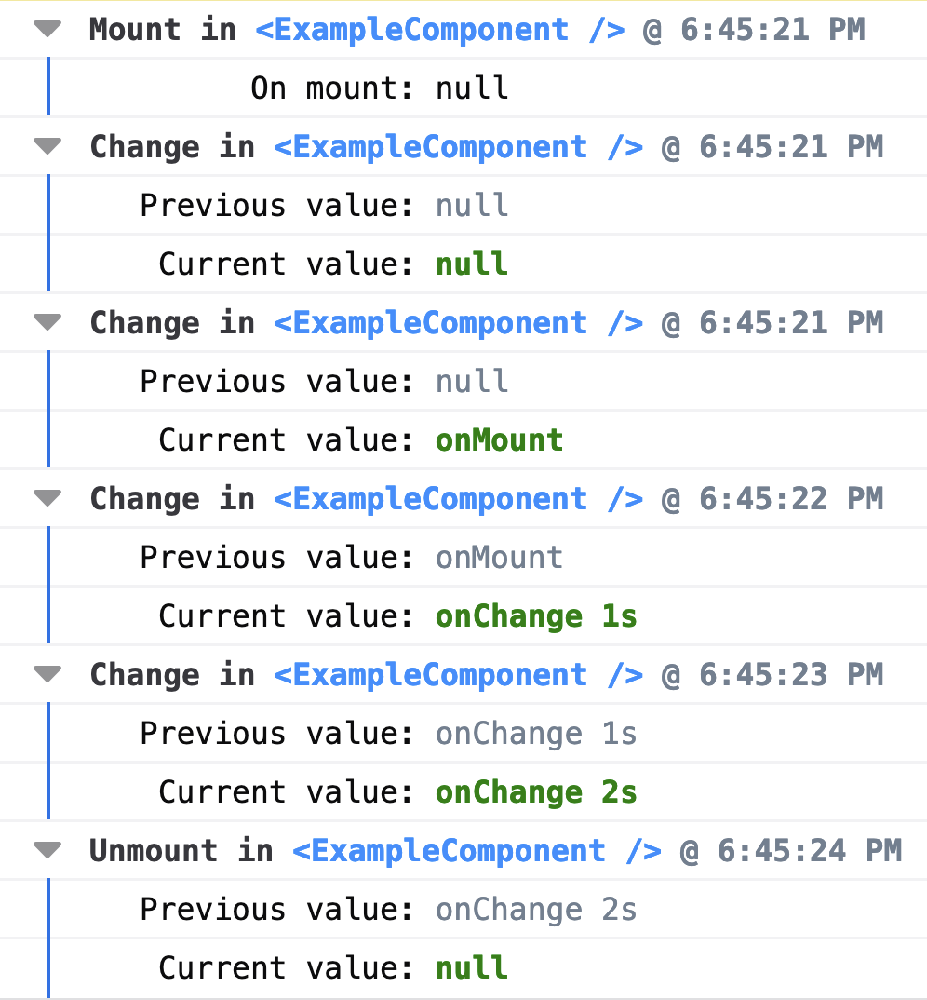

<div align="center">
  <div align="center">
  
  <br>
  <br>
  </div>
  
   
  
  
  
  
  <br>
  <br>
  <div align="center"><strong>🪵 React Log Hook</strong></div>
  <div align="center"> Lightweight & customizable logging hook for your react components lifecycle</div>

  <div align="center">
  <sub>By <a href="https://twitter.com/dolfbarr">Dolf Barr</a></sub>
  </div>
  <br>
  <br>
  <br>
</div>

# 🪵 react-log-hook
React hook for logging per component lifecycle

## Features
- 🪶 **Lightweight** — under *1.5 kB* gzipped & minified
- 🗂️ **Typed** — made with TypeScript, shipped with types
- 🥰 **Simple** — don't worry about any changes in your props & state
- 🔧 **Customizable** — able to change everything you see in the logs
- 🔬 **Tested** — 💯% test coverage
- 🏎️ **Fast** — native react hooks & optimized
- 📭 **No dependecies**


## Install

With npm

```sh
npm install -D react-log-hook
```

With yarn

```sh
yarn add -D react-log-hook
```

## Usage

### Basic usage

```javascript
import { useLog } from 'react-log-hook'

const App = () => {
  // Add a logger
  const { log } = useLog()

  const [state, setState] = useState(null)

  // Log the changes via console in real time!
  log(state)

  return null
}
```

### Configuration options

```javascript
import { useLog } from 'react-log-hook'

const App = () => {
  // Any configuration properties are optional
  const { log } = useLog({
    environments: [
      /** Contains array of environments of `process.env.NODE_ENV` in which logging will be allowed  */
      'dev',
      'development',
    ],

    // Print Options

    styles: {
      /** Contains styles object with different CSS inline styles used in logging */
      componentCSS:
        'color: DodgerBlue' /** Inline css for rendering component name in the logs */,
      changeCSS:
        'color: green; font-weight: bold;' /** Inline css for rendering current value in the logs */,
      subValueCSS:
        'color: SlateGray; font-weight: thin;' /** Inline css for rendering any additional data like time or previous value in the logs */,
    },
    printer: console /** Contains custom implementation of console */,
    logLevel: 'log' /** Level of logging defined by console method */,
    /** Render object or array inline or via interactive browser renderer */
    inline: true,
    isGroupingEnabled: true /** Enable grouping for logs  */,
    isGroupCollapsed: false /** Render groups collapsed  */,
    groupLabelRenderer: (
      /** A function which will be used to render labels for the group  */
      type /** Current stage of component lifecycle: 'Mount' | 'Change' | 'Unmount'  */,
      componentName,
    ) => `${type}${componentName}`,

    // Custom Render Function

    render: function ({
      /** Custom function which will be used for rendering the result, provided with useful data */
      value,
      prevValue,
      type /** Current stage of component lifecycle: 'Mount' | 'Change' | 'Unmount' */,
      componentName,
      inline /** Render object or array inline or via interactive browser renderer */,
      flags: {
        isGrouped /** Enable grouping for logs  */,
        isCollapsed /** Render groups collapsed  */,
      },
    }) {
      console.log(value)
    },
  })

  const [state, setState] = useState(null)

  // It's possible to redefine any configuration option per log call!
  log(state, {
    inline: false,
    logLevel: 'warn',
  })

  return null
}
```

## FAQ

### Will it deep copy the value to make sure it will persist in the logs?

- 🎉 Yes, 🪵 **react-log-hook** deep copies the value to make sure it will not be changed in the logs later

### Do i need to install @types/react-log-hook as well?

- 💪 No, 🪵 **react-log-hook** comes with prebundled types

### Will it run in production evironment?

- ✅ By default 🪵 **react-log-hook** will run only in `dev` or `development` node evironments defined by `NODE_ENV`

## Roadmap

- [x] Add previous state checking
- [x] Use object copy to persist in time
- [x] Use console groups to handle all the logs
- [x] Add dev environment support by default
- [x] Polish the looks with component names, function calls, time etc
- [x] Add more customization options
- [ ] Test with SSR & Server components

## Contributing

- 🌟 Stars & 📥 Pull Requests are welcome for sure! ❤️

### Development

🪵 **react-log-hook** uses npm & npm scripts in development, the following scipts can be handy:

#### `npm run start:demo`
> Starts a demo app with enabled hook to check it in real environment

#### `npm run storybook`
> Starts storybook with example components to test against

#### `npm run release:check`
> Combination of linting, type-checking & tests; runs as precommit hook

## License

[MIT License](LICENSE)
